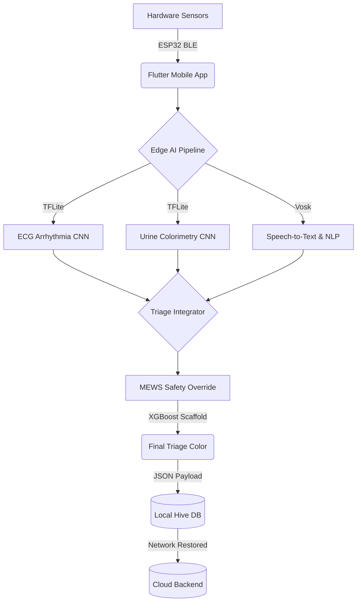

# Raksha-Sim (SwasthaGram)

A portable, multi-sensory clinical triage system running AI directly on the edge. Designed to empower ASHA workers to run 6 critical diagnostic tests in under 3 minutes, fully offline, without requiring laboratory access.

---

## The Problem
India faces a growing healthcare crisis at the grassroots level:
- **1/4 of the population** lives with more than one chronic condition.
- **No immediate diagnostics:** There is no viable way to check critical vitals or symptoms on the spot in rural areas.
- **Overburdened Infrastructure:** A standard Primary Health Centre (PHC) is meant to serve 30,000 people, but currently serves over 34,000. 
- **Inaccessibility:** On average, patients must travel 5.5 km to reach the nearest PHC.
- **Manual Triage:** ASHA workers are forced to manually recommend care without access to diagnostic equipment or quantitative urgency metrics.

## Our Solution
We have built a portable, multi-sensory edge device that revolutionizes rural triage:
- **Comprehensive:** Takes a patient's vitals (ECG, SpO2, Temperature, Urine Colorimetry) alongside local audio symptom inputs.
- **100% Edge AI:** AI inference runs directly on the health worker's smartphone, eliminating the need for constant internet access.
- **Secure Cloud Sync:** Securely stores patient records locally, and automatically uploads them to the cloud whenever connectivity is restored.
- **Instant Triage:** Instantly categorizes patients into urgency tiers (RED, YELLOW, GREEN) using AI classification.
- **Fail-safe Architecture:** Features a robust MEWS (Modified Early Warning Score) safety layer as a fallback to ensure critical patients are never under-triaged.

**The Result:** An ASHA worker in a remote village with no lab access can now run 6 diagnostics in just 3 minutes.

---

## What We Have Achieved (Current State)
- **Hardware Integration:** All sensors are working individually and successfully communicating with the ESP32 microcontroller.
- **BLE Connectivity:** Established a robust Bluetooth Low Energy (BLE) connection between the ESP32 and the smartphone app.
- **Mobile Frontend:** Working, intuitive Flutter app optimized for field use.
- **Cloud Infrastructure:** Fully functioning backend with integrated cloud storage for patient records.
- **Safety Testing:** MEWS safety fallback algorithms evaluated and heavily unit-tested.
- **AI Models:** 
  - 6 CNN models developed for processing individual sensor streams (ECG Arrhythmia, Urine Severity).
  - XGBoost model implemented for the final triage scoring.
  - Basic BERT NLP integration with a fallback vocabulary lexicon for symptom extraction.

## 24-Hour Sprint Roadmap
- **Seamless BLE:** Establish a bulletproof Bluetooth payload parser between the Flutter app and the ESP32.
- **Speech-to-Text Pipeline:** Include offline STT embeddings (`vosk_flutter`) and improve the AI symptom extractor model.
- **Edge Migration:** Successfully shift all computation from the Raspberry Pi entirely to the smartphone (Flutter/TFLite).

## Future Vision
- **Centralized Dashboard:** Create a live monitoring dashboard for local healthcare authorities and PHCs, granting doctors instant access to remote vitals.
- **Outbreak Detection:** Utilize aggregate cloud data to automatically detect and flag regional disease outbreaks.
- **Medical Authentication:** Undergo IEC standard testing and clinical trials to get our diagnostic readings medically authenticated.
- **Continuous AI Improvement:** Train the models on larger, diverse datasets to push accuracy ceilings even higher.
- **Pilot Deployment:** Launch a real-world pilot deployment with ASHA workers in the field.

---

## Architecture & System Design
Raksha operates on a tiered, edge-heavy architecture to ensure maximum reliability in low-connectivity zones.



## Tech Stack & ML Models
- **Frontend & Orchestration:** Flutter / Dart (Cross-platform)
- **Edge Inference Engine:** TensorFlow Lite (TFLite)
- **Local Speech Recognition:** Vosk (Offline ASR)
- **Hardware Integration:** `flutter_blue_plus` (BLE)
- **AI/ML Pipeline:**
  - **ECG CNN:** 1D Convolutional Neural Net for Arrhythmia detection.
  - **Urine CNN:** MLP trained on normalized RGB colorimeter outputs.
  - **NLP Extractor:** BERT embeddings with a bilingual (Hindi/English) fallback lexicon (`clinical_keywords.json`).
  - **Triage Scaffolding:** Hard-coded decision boundaries derived from an XGBoost 3-class booster, combined with clinical MEWS override logic.

---

## Getting Started

### Prerequisites
- Flutter SDK (v3.19.0+)
- Android Studio or Xcode
- An Android device (for BLE testing, iOS requires additional permissions)

### Installation
1. **Clone the repository:**
   ```bash
   git clone https://github.com/anushkasrivastava21/raksha-dash.git
   cd raksha-dash
   ```
2. **Install dependencies:**
   ```bash
   flutter pub get
   ```
3. **Run the App:**
   ```bash
   flutter run
   ```

### Running Tests
To run the MEWS safety fallback and AI integration tests:
```bash
flutter analyze
flutter test
```

---

## Existing Infrastructure Differences
How Raksha compares to existing market solutions:
- **Swasthya Slate:** Runs tests, but provides no urgency score or AI triage layer.
- **AYu Devices:** Only reads one signal (steth/ECG) and still requires a doctor to interpret the results.
- **Swasthya Sahayak:** Captures vitals, but requires constant WiFi and is highly cost-inefficient.

> **Raksha** bridges the gap: highly affordable, multi-sensory, fully offline-capable, and immediately actionable.
